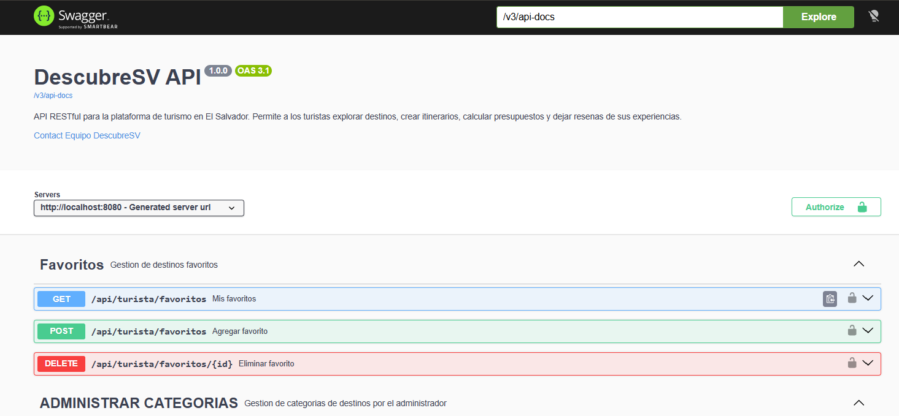
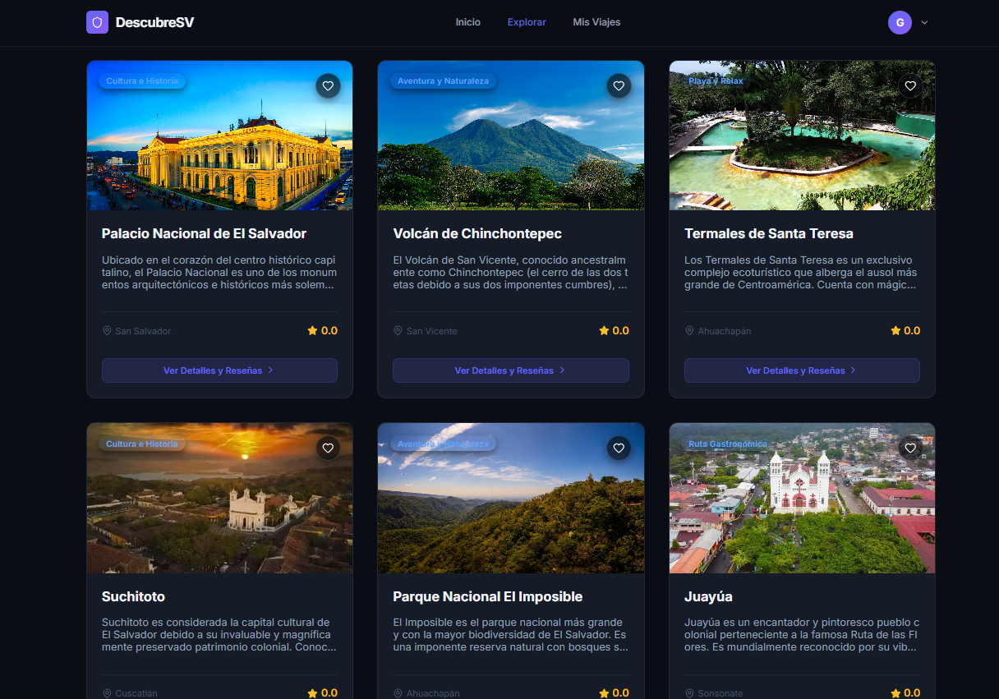

# DescubreSV-AppWeb

## 📋 Descripción del Proyecto

**DescubreSV** es una solución digital diseñada para optimizar la planificación de viajes en El Salvador.
La aplicación permite a los turistas locales y extranjeros **calcular presupuestos personalizados y generar itinerarios basados en destinos emblemáticos,** integrando seguridad robusta y una interfaz dinámica para mejorar la experiencia de los usuarios.

---

### Problema que resuelve

El Salvador carece de una plataforma centralizada que integre catálogo de destinos turísticos, planificación de rutas y estimación de costos en un solo lugar. **DESCUBRESV** cubre esa brecha ofreciendo una experiencia guiada tanto para viajeros nacionales como internacionales.

### Funcionalidades principales

| Módulo                        | Descripción                                                               |
| ----------------------------- | ------------------------------------------------------------------------- |
| 🔐 Autenticación              | Registro e inicio de sesión con JWT + control de roles (Admin / Turista) |
| 🗺️ Catálogo de Destinos       | Listado, filtrado y detalle de destinos turísticos del país              |
| 📅 Itinerarios                | Creación, edición y seguimiento de planes de viaje personalizados        |
| 💰 Calculadora de Presupuesto | Estimación de costos por transporte, alojamiento y alimentación          |
| ⭐ Reseñas y Favoritos        | Los usuarios pueden calificar destinos y guardar favoritos               |
| 👤 Panel de Administración    | Gestión de usuarios y destinos desde un dashboard protegido              |

---

## 🗺️ Diagrama Entidad-Relación (DER)


**Diagrama Entidad-Relación DESCUBRESV]**


> 📁 El archivo SQL completo se encuentra en `/database/schema.sql`

### Descripción de Tablas

| Tabla                 | Atributos principales                                                                                                                                                                      | Descripción                                           |
| --------------------- | ------------------------------------------------------------------------------------------------------------------------------------------------------------------------------------------ | ----------------------------------------------------- |
| **Usuario**           | IDUsuario (PK), Nombre, Correo, Nacionalidad, Preferencias, PresupuestoEstimado                                                                                                            | Representa a los usuarios de la plataforma            |
| **Destino**           | IDDestino (PK), Nombre, Descripción, Departamento, Entrada, Horario, MejorÉpoca, Tipo, DistanciaDesdeCapital, CómoLlegarVehículo, CómoLlegarBus, CoordenadasMapa, Imagen, IDCategoría (FK) | Información completa de cada destino turístico        |
| **Itinerario**        | IDItinerario (PK), IDUsuario (FK), FechaInicio, FechaFin, Duración, PresupuestoTotal, TipoExperiencia, CompañíaViaje, ModoPlanificación                                                    | Plan de viaje creado por un usuario                   |
| **ItinerarioDestino** | IDItinerario (FK), IDDestino (FK)                                                                                                                                                          | Tabla intermedia N:M entre Itinerario y Destino       |
| **Presupuesto**       | IDPresupuesto (PK), IDItinerario (FK), CostoTransporte, CostoAlimentación, CostoEntradas, Total, Moneda                                                                                    | Desglose de costos asociado a un itinerario           |
| **Transporte**        | IDTransporte (PK), Tipo, Costo, Capacidad, TiempoEstimado, IDDestino (FK)                                                                                                                  | Opciones de transporte hacia un destino               |
| **Alimentación**      | IDAlimentación (PK), Nombre, TipoComida, PrecioPromedio, Ubicación, Horarios, IDDestino (FK)                                                                                               | Opciones de alimentación cerca de un destino          |
| **CategoríaDestino**  | IDCategoría (PK), NombreCategoía, Descripción                                                                                                                                              | Clasificación de destinos (playa, volcán, lago, etc.) |
| **Favorito**          | IDFavorito (PK), IDUsuario (FK), IDDestino (FK), FechaGuardado                                                                                                                             | Destinos guardados por un usuario                     |
| **Reseña**            | IDReseña (PK), IDUsuario (FK), IDDestino (FK), Calificación, Comentario, Fecha                                                                                                             | Valoraciones de usuarios sobre destinos               |

### Relaciones principales

| Relación                       | Tipo | Descripción                                      |
| ------------------------------ | ---- | ------------------------------------------------ |
| `Usuario` → `Itinerario`       | 1:N  | Un usuario puede tener muchos itinerarios        |
| `Itinerario` ↔ `Destino`       | N:M  | Via tabla `ItinerarioDestino`                    |
| `Itinerario` → `Presupuesto`   | 1:1  | Cada itinerario tiene un presupuesto detallado   |
| `Destino` → `Transporte`       | 1:N  | Un destino tiene varias opciones de transporte   |
| `Destino` → `Alimentación`     | 1:N  | Un destino tiene varias opciones de alimentación |
| `Destino` → `CategoríaDestino` | N:1  | Cada destino pertenece a una categoría           |
| `Usuario` → `Favorito`         | 1:N  | Un usuario puede guardar muchos favoritos        |
| `Usuario` → `Reseña`           | 1:N  | Un usuario puede escribir muchas reseñas         |
| `Destino` → `Reseña`           | 1:N  | Un destino puede tener muchas reseñas            |

---

## 🛠️ Stack Tecnológico

| Capa                     | Tecnología                                        |
| ------------------------ | ------------------------------------------------- |
| **Backend**              | Java 21 · Spring Boot 3.x · Spring Security · JWT |
| **Base de Datos**        | PostgreSQL · Spring Data JPA / Hibernate          |
| **Frontend**             | React 18 · TypeScript · Tailwind CSS · Zustand    |
| **HTTP Client**          | Axios                                             |
| **Documentación API**    | Swagger / SpringDoc OpenAPI                       |
| **Despliegue**           | Docker · Docker Compose                           |
| **Control de versiones** | Git · GitHub                                      |

---

## 📁 Estructura del Repositorio

```
/
├── backend/                    # Spring Boot — API REST
│   ├── src/main/java/com/descubresv/
│   │   ├── controller/         # REST Controllers (@RestController)
│   │   ├── service/            # Lógica de negocio
│   │   ├── repository/         # Interfaces JpaRepository
│   │   ├── model/              # Entidades JPA (@Entity)
│   │   ├── dto/                # Data Transfer Objects
│   │   ├── security/           # Configuración JWT + Spring Security
│   │   └── exception/          # Manejo global de excepciones
│   ├── src/main/resources/
│   │   └── application.yml     # Configuración del entorno
│   ├── Dockerfile
│   └── build.gradle
│
├── frontend/                   # React + TypeScript SPA
│   ├── src/
│   │   ├── pages/              # Vistas principales
│   │   ├── components/         # Componentes reutilizables
│   │   ├── hooks/              # Custom hooks (useTheme, useAuth...)
│   │   ├── store/              # Estado global con Zustand
│   │   ├── services/           # Llamadas a la API con Axios
│   │   └── index.css           # Variables CSS y estilos globales
│   ├── Dockerfile
│   └── vite.config.ts
│
├── database/
│   ├── schema.sql              # Script de creación de tablas
│   └── DER.png                 # Diagrama Entidad-Relación exportado
│
├── docker-compose.yml          # Orquestación completa del sistema
└── README.md
```

---

## 🚀 Manual de Despliegue con Docker

### Prerrequisitos

- [Docker Desktop](https://www.docker.com/products/docker-desktop/) instalado y en ejecución
- [Git](https://git-scm.com/) instalado
- Puerto `5432` (PostgreSQL), `8080` (Backend) y `5173` (Frontend) disponibles

### Pasos para ejecutar el sistema

**1. Clonar el repositorio**

```bash
git clone https://github.com/TU_USUARIO/descubresv-appweb.git
cd descubresv-appweb
```

**2. Levantar todo el sistema con un solo comando**

```bash
docker-compose up --build
```

> Este comando construye las imágenes de los tres servicios (PostgreSQL, Spring Boot y React) y los levanta en orden gracias a las dependencias configuradas en `docker-compose.yml`.

**3. Acceder a la aplicación**

| Servicio              | URL                                   |
| --------------------- | ------------------------------------- |
| 🌐 Frontend (React)   | http://localhost:5173                 |
| ⚙️ Backend (API REST) | http://localhost:8080/api             |
| 📄 Swagger UI         | http://localhost:8080/swagger-ui.html |
| 🗄️ PostgreSQL         | localhost:5432 / db: `descubresv_db`  |

**4. Detener el sistema**

```bash
docker-compose down
```

Para eliminar también los volúmenes de datos:

```bash
docker-compose down -v
```

### Variables de entorno (configuradas en `docker-compose.yml`)

```yaml
SPRING_DATASOURCE_URL: jdbc:postgresql://db:5432/descubresv_db
SPRING_DATASOURCE_USERNAME: descubresv_user
SPRING_DATASOURCE_PASSWORD: descubresv_pass
JWT_SECRET: tu_clave_secreta_aqui
```

---

## 🔌 Tabla de Endpoints (API REST)

### 🔐 Autenticación

| Método | Endpoint             | Descripción                  | Auth |
| ------ | -------------------- | ---------------------------- | ---- |
| `POST` | `/api/auth/register` | Registrar nuevo usuario      | ❌   |
| `POST` | `/api/auth/login`    | Iniciar sesión → retorna JWT | ❌   |

### 👤 Usuarios

| Método   | Endpoint             | Descripción                  | Auth     |
| -------- | -------------------- | ---------------------------- | -------- |
| `GET`    | `/api/usuarios`      | Listar todos los usuarios    | 🔒 Admin |
| `GET`    | `/api/usuarios/{id}` | Obtener usuario por ID       | 🔒       |
| `PUT`    | `/api/usuarios/{id}` | Actualizar datos del usuario | 🔒       |
| `DELETE` | `/api/usuarios/{id}` | Eliminar usuario             | 🔒 Admin |

### 🗺️ Destinos

| Método   | Endpoint                        | Descripción               | Auth     |
| -------- | ------------------------------- | ------------------------- | -------- |
| `GET`    | `/api/destinos`                 | Listar todos los destinos | ❌       |
| `GET`    | `/api/destinos/{id}`            | Obtener destino por ID    | ❌       |
| `GET`    | `/api/destinos?categoria={cat}` | Filtrar por categoría     | ❌       |
| `POST`   | `/api/destinos`                 | Crear destino             | 🔒 Admin |
| `PUT`    | `/api/destinos/{id}`            | Actualizar destino        | 🔒 Admin |
| `DELETE` | `/api/destinos/{id}`            | Eliminar destino          | 🔒 Admin |

### 📅 Itinerarios

| Método   | Endpoint                | Descripción                    | Auth |
| -------- | ----------------------- | ------------------------------ | ---- |
| `GET`    | `/api/itinerarios`      | Listar itinerarios del usuario | 🔒   |
| `GET`    | `/api/itinerarios/{id}` | Obtener itinerario por ID      | 🔒   |
| `POST`   | `/api/itinerarios`      | Crear itinerario               | 🔒   |
| `PUT`    | `/api/itinerarios/{id}` | Actualizar itinerario          | 🔒   |
| `DELETE` | `/api/itinerarios/{id}` | Eliminar itinerario            | 🔒   |

### ⭐ Reseñas

| Método   | Endpoint                     | Descripción                  | Auth |
| -------- | ---------------------------- | ---------------------------- | ---- |
| `GET`    | `/api/destinos/{id}/reseñas` | Listar reseñas de un destino | ❌   |
| `POST`   | `/api/reseñas`               | Crear reseña                 | 🔒   |
| `DELETE` | `/api/reseñas/{id}`          | Eliminar reseña propia       | 🔒   |

### ❤️ Favoritos

| Método   | Endpoint              | Descripción                  | Auth |
| -------- | --------------------- | ---------------------------- | ---- |
| `GET`    | `/api/favoritos`      | Listar favoritos del usuario | 🔒   |
| `POST`   | `/api/favoritos`      | Agregar destino a favoritos  | 🔒   |
| `DELETE` | `/api/favoritos/{id}` | Quitar de favoritos          | 🔒   |

> 🔒 = Requiere `Authorization: Bearer <token>` en el header  
> 📄 Documentación interactiva completa disponible en `/swagger-ui.html`

---

## 🔐 Flujo de Seguridad (JWT)

```
Cliente (React)                    Backend (Spring Boot)
      │                                       │
      │  POST /api/auth/login                 │
      │  { email, password }  ──────────────▶│
      │                                       │ Valida credenciales
      │                                       │ Genera JWT (HS256)
      │◀─────────────────────────────────────│
      │  { token: "eyJhbG..." }               │
      │                                       │
      │  GET /api/destinos                    │
      │  Authorization: Bearer eyJhbG... ───▶│
      │                                       │ Valida firma del token
      │                                       │ Extrae rol del usuario
      │◀─────────────────────────────────────│
      │  200 OK — [{ destinos... }]           │
```

- Token almacenado en el store de Zustand (memoria del cliente)
- Interceptor de Axios inyecta el token automáticamente en cada petición
- Rutas protegidas a nivel de Spring Security con `@PreAuthorize`

---

## 📸 Evidencias de Funcionamiento

> Las capturas de pantalla de Swagger UI y la interfaz de usuario se encuentran en la carpeta `/docs/evidencias/` del repositorio.

### Swagger UI



### Login y generación de token JWT


### Panel de Administración


### Vista de Destinos (Frontend React)



---

## 👥 Equipo de Desarrollo

| Nombre                              | Carnet    |
| ----------------------------------- | --------- |
| José Wilfredo Ponce Barahona        |  PB24007  |
| Ana Estefany Quintanilla de Ponce   |  QP24002  |
| Daniel Alexis Ramirez Martinez      |  RM24082  |
| Javier Alexander Rodriguez Flores   |  RF24006  |
| Eileen Marisol Reyes Rodriguez      |  RR24044  |

---

## 📜 Licencia

Este proyecto fue desarrollado con fines académicos para la asignatura **Desarrollo de Aplicaciones Web (DAW135)** de la Universidad de El Salvador.

---

## 👥 Tutor Asignado

**| GT01 Ing. Andrea Victoria Castro Jiménez |**

---

## 🏛️ Información Institucional

|                                |                                                 |
| :----------------------------- | :---------------------------------------------- |
| **UNIVERSIDAD DE EL SALVADOR** | **INGENIERÍA EN DESARROLLO DE SOFTWARE - 2026** |

---
